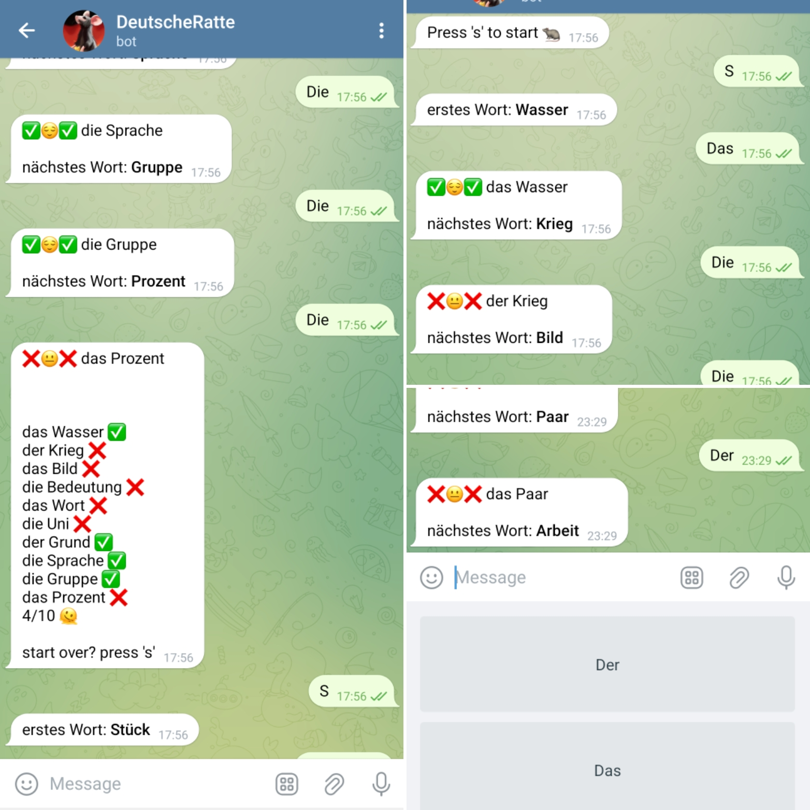

# DEUTSCHE RATTE - Telegram bot teaching german articles

Learn German articles with simple game using this Telegram bot built with Node.js.

## Table of Contents

- [Introduction](#introduction)
- [Features](#features)
- [Getting Started](#getting-started)
  - [Prerequisites](#prerequisites)
  - [Installation](#installation)
- [Why](#why)

## Introduction

The German Article Learning Bot is designed to make learning German articles entertaining and easy. All whithout using external "black box" packages, with an easy to understand code and many opportunities to add more features.

## Features

- Pure Node.js technology with no obscure packages.
- Ready infrastructure for adding any DB.
- Jest testing.
- Local server that can be easily switch to run on amazon lambda.
- Scraping capabilities to fetch data.

## Getting Started

### Prerequisites

Before you get started, ensure you have the following installed on your system:

- Node.js
- Yarn
- Telegram, go to "BotFather" and create a bot, receive `YourToken`.
- Way to expose local IP on port 8080 (can be easily done with "ngrok")

### Installation

1. Clone the repository
2. Add an `.env` file with `TELEGRAM_TOKEN={YourToken}`
3. If using "ngrok", run in a terminal `ngrok http 8080` you will get `YourPublicURL`
4. Open your web browser and type `https://api.telegram.org/bot{YourToken}/setWebhook?url={YourPublicURL}` 
5. Open Terminal with the clone repository and `yarn srart`
6. Play

## Why

1. Easy to understand
2. Simplfy Telegram API
3. Includes a scraper
4. Can be used locally
5. Sit on the Toilet and learn Deutsch